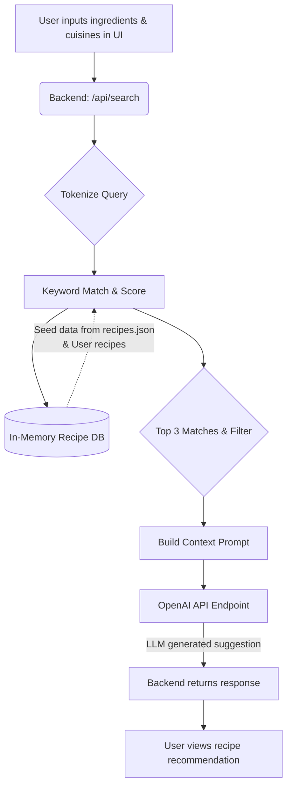

# 🍽 AI Recipe Creator

A smart recipe finder and generator application. It takes a list of ingredients and optional cuisine preferences, searches through an in-memory database of recipes, and uses an OpenAI-compatible API to generate a personalized recipe suggestion.

## How It Works



### Detailed Flow

#### 1. Input
The user provides a list of ingredients (e.g., `chicken, garlic, lemon`) and optionally selects specific cuisine categories through the frontend UI. This data is sent to the `/api/search` backend endpoint.

#### 2. Internal Works
- **Tokenize Query:** The backend normalizes the input ingredients and splits them into individual keywords (ignoring words 2 characters or shorter).
- **Match & Score:** The server scans an in-memory database of recipes (seeded from `data/recipes.json` plus any user-added recipes). Each recipe receives a score based on how many input keywords appear in its combined text (title, ingredients, instructions).
- **Filter & Select:** If specific cuisines were requested, non-matching recipes are filtered out. The results are sorted by score, and the top 3 matching recipes are selected.
- **Build Context Prompt:** The full text of the top 3 matching recipes is injected into a system prompt. The prompt instructs the LLM to act as a cooking assistant and suggest a recipe utilizing the user's ingredients, leaning on the provided recipes as a foundational reference.
- **LLM Generation:** The context-rich prompt is sent over an OpenAI-compatible API to generate a personalized response.

#### 3. Output
The LLM returns a tailored recipe or variation. The backend forwards this response to the frontend—along with the titles of the database recipes used as context—for the user to view.

## Application Stack

| Layer       | Tech                            |
|-------------|---------------------------------|
| Backend     | Node.js + Express               |
| AI / LLM    | OpenAI Compatible API (e.g., gemma3:27b)|
| Database    | In-memory JavaScript array      |
| Frontend    | HTML / CSS / JavaScript         |
| Deployment  | Docker + Docker Compose         |

---

## Setup & Running Locally

### 1. Configure Environment

Create a `.env` file in the root directory (or use the existing one) with your API details:

```env
OPENAI_BASE_URL=https://your-api-url.com/v1
OPENAI_API_KEY=your_api_key_here
CHAT_MODEL=gemma3:27b
PORT=6767
```

### 2. Run with Docker Compose

```bash
docker compose up --build
```
*(Or, use `npm install && npm start` to run directly via Node.js).*

### 3. Open the App

Visit [http://localhost:6767](http://localhost:6767) (or the port defined in your `.env`).

On the first run, the app will automatically seed the in-memory database with starter recipes from `data/recipes.json`.

---

## Usage

* **Find a recipe:** Enter your ingredients (e.g. `chicken, garlic, lemon`), optionally filter by cuisine categories, and press Search.
* **Add a recipe:** You can submit your own recipes. They will be immediately added to the local server memory and used as context in your future recipe searches.

## Project Structure

```
.
├── server.js              # Express backend logic + API Routes + OpenAI integration
├── data/
│   └── recipes.json       # Initial seed recipes loaded on app start
├── public/                # Frontend UI (HTML, CSS, JS)
├── compose.yml            # Docker Compose configuration
├── Dockerfile             # Docker image build configuration
├── package.json           # Node.js dependencies
└── README.md              # Project documentation
```
